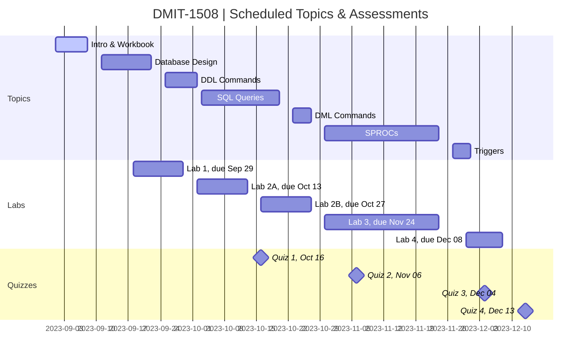

# Agenda

> These are my notes on what I plan to teach in each upcoming class.

----

```mermaid
gantt
    dateFormat  YYYY-MM-DD
    title       DMIT-1508 | Scheduled Topics & Assessments
    %% excludes    weekends
    %% (`excludes` accepts specific dates in YYYY-MM-DD format, days of the week ("sunday") or "weekends", but not the word "weekdays".)

    section Topics
    %% done - for finished tasks
    %% active - for current tasks
    %% crit - for red outline/background
    Intro & Workbook          :active,  part0, 2023-09-01, 2023-09-08
    Database Design           :         part1, 2023-09-11, 2023-09-22
    DDL Commands              :         part2, 2023-09-25, 2023-10-02
    SQL Queries               :         part3, 2023-10-03, 2023-10-20
    DML Commands              :         part4, 2023-10-23, 2023-10-27
    SPROCs                    :         part5, 2023-10-30, 2023-11-24
    Triggers                  :         part6, 2023-11-27, 2023-12-01

    section Labs
    Lab 1, due Sep 29  :     2023-09-18, 2023-09-29
    Lab 2A, due Oct 13 :     2023-10-02, 2023-10-13
    Lab 2B, due Oct 27 :     2023-10-16, 2023-10-27
    Lab 3, due Nov 24  :     2023-10-30, 2023-11-24
    Lab 4, due Dec 08  :     2023-11-30, 2023-12-08

    section Quizzes
    Quiz 1, Oct 16 :milestone, 2023-10-16, 0d
    Quiz 2, Nov 06 :milestone, 2023-11-06, 0d
    Quiz 3, Dec 04 :milestone, 2023-12-04, 0d
    Quiz 4, Dec 13 :milestone, 2023-12-13, 0d

```
