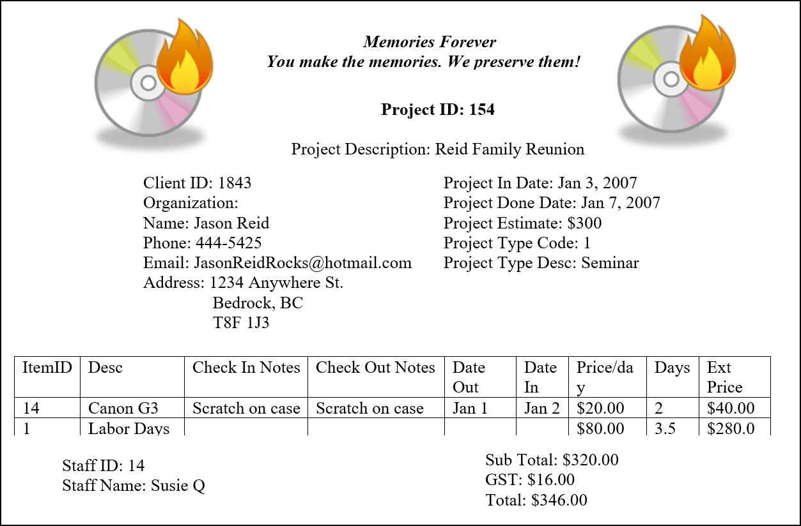
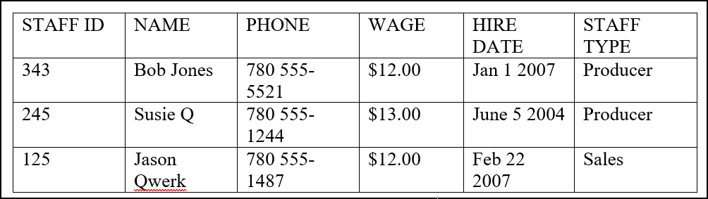
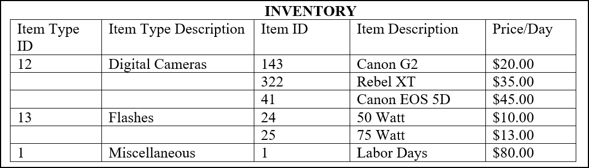

# Memories Are Forever

> This database design exercise has been designed as a practice in normalization. In this exercise, you will analyze documentation and interpret business requirements. An answer key will be provided for you to compare your answers with an expected solution.

Memories Forever is a new company that preserves memories on DVD and VHS media. Typically a client will give the company video tape and photos to produce in to a video. Typical events that are produced for clients are training seminars, family reunions, weddings, birthdays, and other special events. As well, some clients rent equipment from the company such as camcorders and digital cameras.

Memories Forever is anticipating their business will be a huge success so they would like to have a database created to manage their data. It will manage information such as rentals, productions, staffing, and possibly in the future payroll. 

The company has been running for a couple months and have used paper based systems to record their data. Your job is to convert that to a SQL Server Relational Database system.

PHASE I – Database Design

From the following views create a 3NF database design. Merge the 3 views into one 3NF ERD.

## Project Invoice View

- A client receives an invoice at the end of the project that is due in full when it is received.
- The staff that work on the project are rewarded by commissions and other awards so their names are recorded on the invoice. 
- Project estimates are just estimates and in no way reflect the actual final cost of a project. 
- Projects are all associated with a category such as Seminar, Reunion, Education, Sports, etc….
- ItemID 1 is always labor costs and reflects the time and effort in creating the product. 
- Due to limited rental stock a client may rent only one of any item
- The items are reviewed by the staff member and the client before and after renting noting the condition of the item.

## Staff Information View

Important Information about each staff member is stored in a simple spreadsheet.

- Staff members are all of one particular Staff Type.

## Inventory View

Information is kept on each item in inventory that Memories Forever rents or supplies.

