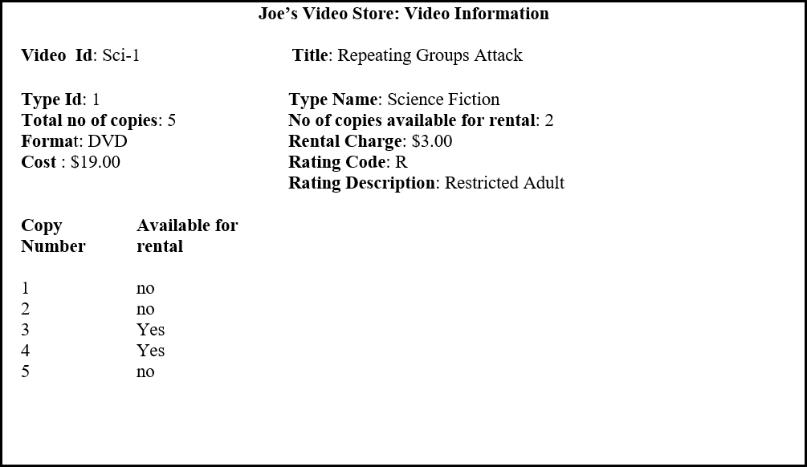

# Joe's Video Store

> This database design exercise has been designed as a practice in normalization. In this exercise, you will analyze documentation and interpret business requirements. An answer key will be provided for you to compare your answers with an expected solution.

Joe wants you to develop a small database application to help him run his video rental store.  Tracking video information is one system requirement.

## Video Information View

You are to develop a view schema, in 3NF for the  Video information view. 

A sample screen layout is shown below:

Business Rules:

1.	Movie Types are :Horror, Comedy, Action, Romance, Science fiction,..
2.	Formats are: VHS, VCD, DVD. 
3.	Movie Ratings are: Children, Youth, Adult, Restricted Adult, and X-Rated
4.	Copy Number is unique within Video Id  (the first copy of any given video is copy number 1).

You are to produce a view schema in 3NF.  Document any assumptions you make.  
Merge this user view with the Video rentals user view .

## Customer Rents Video View

You are to develop a view schema, in 3NF for the Customer Rents Video view. 

A sample screen layout is shown below:

Business Rules:

1.	A customer may have a maximum of ten videos rented simultaneously.
2.	Joe knows the rental charges change over time so he wants the system to record the rental charge for each video on a transaction (historical information) as well as record the current rental charge for each video. 
3.	Transaction Id, Customer Id and Video Id are unique
4.	Copy Number is unique within Video Id  (the first copy of any given video is copy number 1).

You are to produce a view schema in 3NF.  Show the schema in ERD notation.  Document any assumptions you make.  
